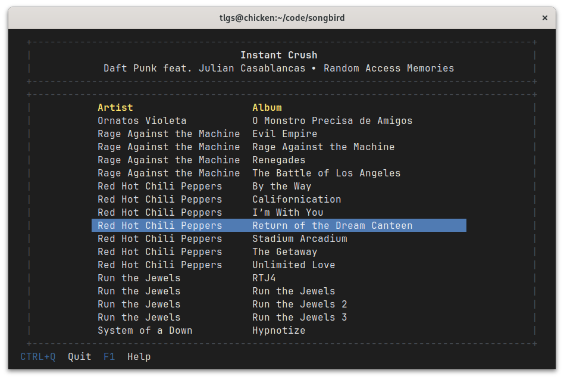

# songbird

songbird is a non-portable, barebones Sonos local music caster TUI app.
Because I don't feel like running a music server and setting up a Sonos music source.

Sporting exquisite non-features like:

- [GNOME Tracker](https://tracker.gnome.org/) dependence
- inability to select Sonos unit
- ~~no controls other than album selection~~

## Development

- install and setup project with `pip install -e .[dev]` and `pre-commit install`
